# Vehicle Aerodynamics and Pedestrian-Gust Modelling

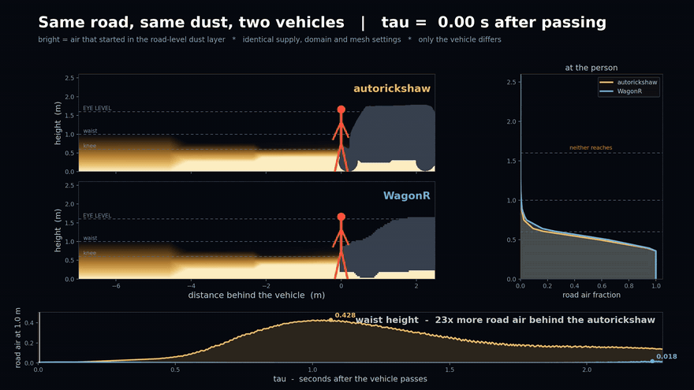

Two vehicles, one dust supply, identical domain and mesh. The autorickshaw carries road air to
waist height and the hatchback holds it at the ankles, a factor of 23 at 1.0 m. Neither reaches
the face. Full resolution in [docs/media/](docs/media/).

This study measures the air and road dust a passing vehicle delivers to a person standing at the
kerb. Four road vehicles were run through one identical CFD pipeline, from geometry preparation
and a documented acceptance test, through steady and transient solves, to figures that regenerate
from committed data. The workflow was built end to end: Blender for geometry repair and voxel
wrapping, OpenFOAM for the solve, and Python for analysis and figure generation.

The autorickshaw measures a drag coefficient of 0.434 against 0.338 for a tall hatchback, and
delivers 2.16x the lateral gust energy of that car in the band spanning eye level and 23x the
road-dust concentration at waist height. Dust reaches 1.25 m above the road. The principal
limitation is that wheels are static geometry, so the model covers redistribution of air and
leaves dust entrainment to a separate treatment.

## 1. Questions tested

Two claims are examined, and they require different instruments.

1. **Drag.** How does an autorickshaw compare with ordinary Indian cars, measured as a drag
   coefficient on an identical pipeline?
2. **Pedestrian exposure.** How much sideways air and road dust reaches a bystander, measured
   along the path that person walks?

The drag results bear on the exposure question only through the shared geometry. Section 5 reports
the exposure result on its own transient cases.

## 2. Study design

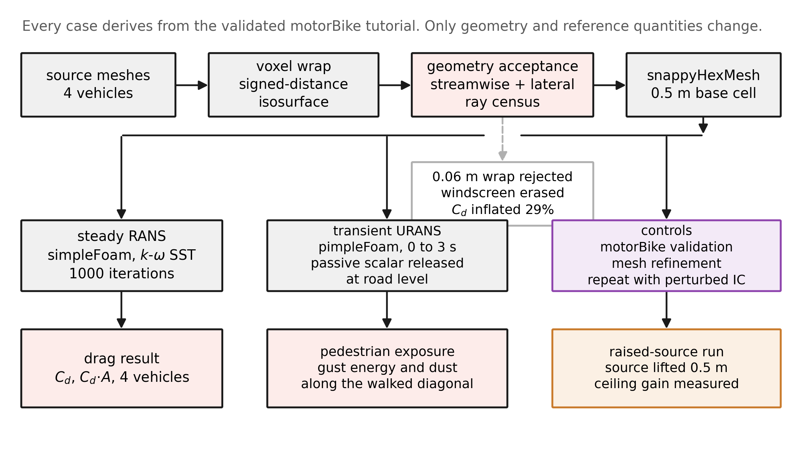

FIGURE 1: Study design, from source geometry to the two result sets. Grey boxes are processing
steps and pink boxes are results. Purple marks the control runs and orange the source-height
experiment. The pale outlined box records the 0.06 m wrap discontinued by the acceptance test,
retained here because the reason for discontinuing it defines the test now applied to every mesh.
Dashed lines carry a procedural relationship and solid lines carry data. Every case derives from
the validated motorBike tutorial, with only geometry and reference quantities changed.

## 3. Validation

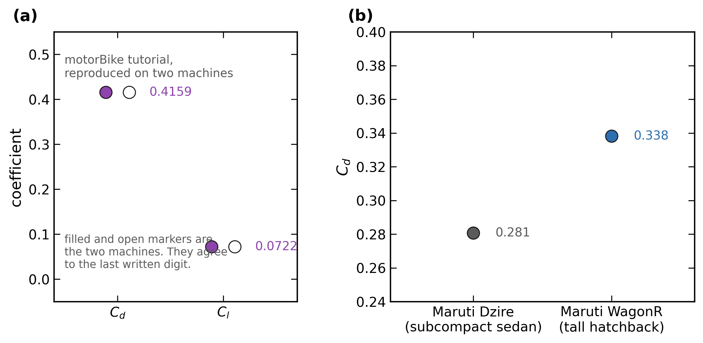

FIGURE 2: Validation of the pipeline. (a) The OpenFOAM motorBike tutorial reproduced at Cd 0.4159
and Cl 0.0722. Filled and open markers are a Ryzen 5 3600 and a Ryzen 5 5600X, which agree to the
last written digit. (b) Measured Cd for the two cars against published ranges for their vehicle
class. Points are the mean over the final 200 iterations. Indicative class ranges appear in
`analysis/data/tables.py` as `PUBLISHED_UNSOURCED` and stay in the data module until a primary
source is traced for them.

The install reproduces the reference tutorial, and the same case reproduces identically on the two
machines tested. This shows the numerics are the reference ones and that the result is stable
across those two configurations. Machine independence in general would need a wider set of
configurations.

Running both bodies through an identical pipeline is the rationale for reporting ratios: mesh and
turbulence-model error are expected to act in the same direction on both, so a ratio is less
sensitive to them than either absolute value. How far that cancellation goes for these cases
remains open. The ratios reported here are the result, and absolute Cd is approximate.

## 4. Drag

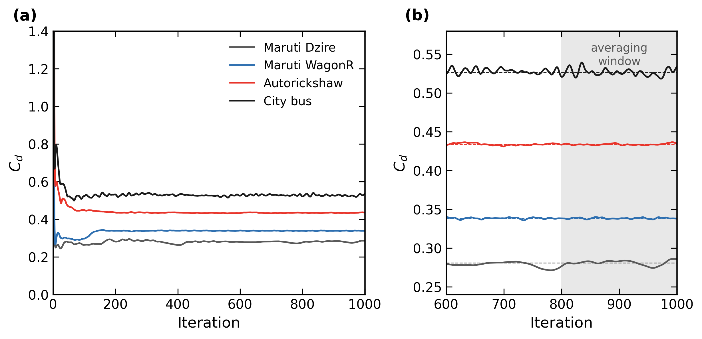

FIGURE 3: Force-coefficient history for all four vehicles. (a) The full 1000 iterations. (b) The
final 400 iterations, with the shaded averaging window and each vehicle window mean as a dashed
line. Steady RANS on a bluff body settles into a limit cycle and continues to oscillate, so every
value quoted here is a mean over the final 200 iterations with its oscillation band. Colours follow
the fixed mapping used throughout: red autorickshaw, blue WagonR, grey Dzire, black city bus.

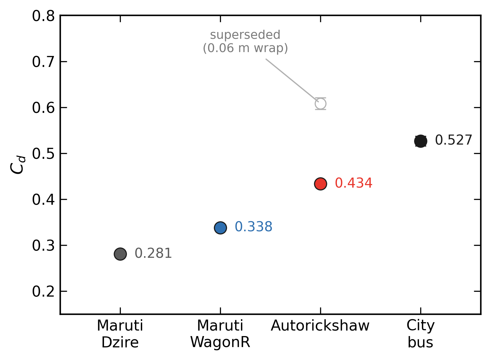

FIGURE 4: Drag coefficient by vehicle. Points are the mean over the final 200 iterations and error
bars span the oscillation band across that window, which is 1.0% for the autorickshaw and WagonR
and about 4% for the Dzire and bus. The open grey marker is a superseded autorickshaw result of
0.608 produced by a 0.06 m wrap that had erased the windscreen, retained because the correction is
part of the method. The corrected geometry gives 0.434, with the band tightening from 4.2% to
1.0%.

| vehicle | Cd | band | A_ref (m2) | Cd.A | cells |
|---|---|---|---|---|---|
| Autorickshaw | 0.434 | 1.0% | 2.162 | 0.938 | 693k |
| Maruti WagonR | 0.338 | 1.0% | 2.266 | 0.767 | 549k |
| Maruti Dzire | 0.281 | 4.1% | 2.332 | 0.655 | 561k |
| City bus | 0.527 | 4.0% | 7.851 | 4.136 | 2.48M |

TABLE 1: Drag results for the four vehicles. Cd is the mean over the final 200 iterations and band
is (max minus min) divided by mean across that window. A_ref is the frontal area measured on a
2 mm raster.

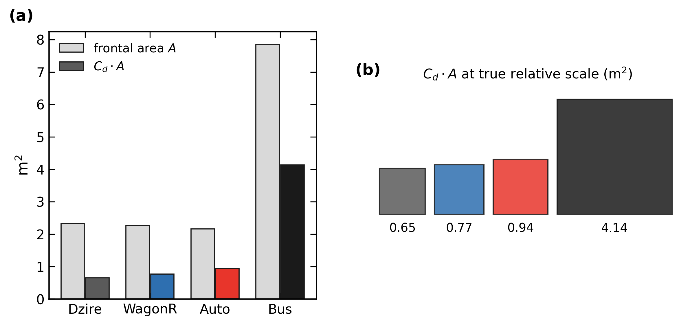

FIGURE 5: Frontal area and drag area. (a) Frontal area A in grey beside Cd.A in the vehicle colour.
(b) The same Cd.A values drawn as squares at true relative area, which is the quantity that sets
fuel burn and roughly scales the volume of air a vehicle displaces.

The autorickshaw measures 1.28x the drag coefficient of the tall hatchback and 1.54x that of the
subcompact sedan, at a frontal area within 7% of both. Ordering the four by Cd places it third of
four: bus 0.527, autorickshaw 0.434, WagonR 0.338, Dzire 0.281. On Cd.A it is second lowest of the
four and 4.4x below the bus. This result describes a moderate difference within the ordinary range
of road vehicles. Two comparator cars support a comparison against those two vehicles, and a claim
about Indian cars in general would require a fleet. The bus is a Japanese city bus, used here as
an upper bound on road-vehicle drag, and its result speaks for that vehicle alone.

## 5. Pedestrian exposure

The solve holds the vehicle fixed and the pedestrian tracks x = -12 + U*t, passing the vehicle at
t = 0.72 s. Reading the diagonal x = U*tau through the (x, t) plane data recovers the exposure
history the walking person receives. The lateral velocity component is Galilean invariant, so the
frame change is exact and a fixed-frame solve answers a roadside question about a moving vehicle
directly. A plane-wide maximum is a different quantity, reporting air away from the kerb, so every
value here comes from the diagonal.

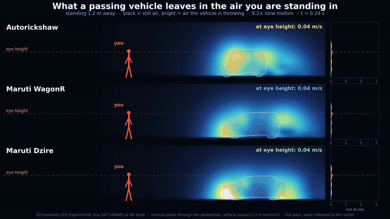

The full pass at the pedestrian plane, 9.2x slow motion, one colour scale across all three
vehicles. Bright is air the vehicle is throwing. The eye line is marked on each panel and the
strip at the right reads the speed at the person.

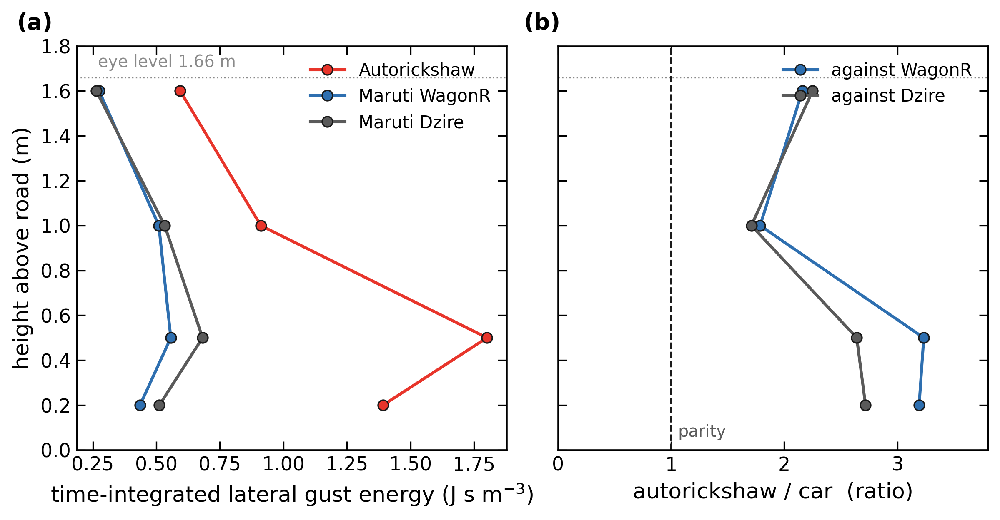

FIGURE 6: Time-integrated lateral gust energy along the pedestrian diagonal on the refined mesh.
(a) Energy against height for three vehicles. (b) The ratio of the autorickshaw to each car, with
parity marked. The metric integrates over the whole pass, so the value comes from all of it.
Sampling is by band: each plotted height is the centre of a 0.5 m band, so the topmost point at
1.60 m covers 1.35 to 1.85 m and contains the 1.66 m eye line drawn on the axis. Values are taken
from docs/REPORT.md section 7.

In the band centred at 1.60 m, which spans eye level, the autorickshaw delivers 2.16x the lateral
gust energy of the WagonR and 2.25x that of the Dzire. Two comparators differing greatly in shape
land within 4% of each other, so the result describes the autorickshaw and holds under the choice
of comparator. The ranking of the two cars moves with height, so a single fixed height imposes an
ordering that the continuous curves show to be height-dependent. Read the profile for shape. Face
and chest energies moved 8 to 17% between the baseline and refined meshes, and ankle and knee
energies roughly doubled. Two meshes give a sensitivity result. Grid convergence needs a third,
finer mesh, which remains to be run, so the low-level magnitudes stay mesh-dependent and the
analysis establishes their direction only.

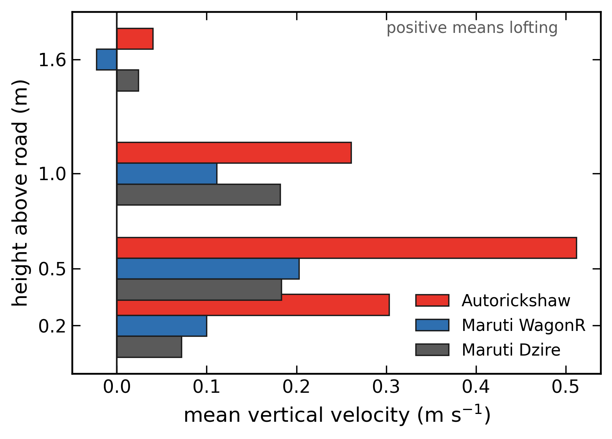

FIGURE 7: Mean signed vertical velocity by height band for three vehicles, from docs/REPORT.md
section 7. Positive values indicate lofting.

All three vehicles loft air at nearly every height, and the autorickshaw lofts 2 to 3x harder than
either car, most strongly at knee level. An earlier draft reported a sign split between the
autorickshaw and the WagonR, quoting a single aggregate over the 0.4 to 1.6 m column as though it
were a per-height figure. Measured again per height band across all three vehicles, that result
disagreed with the original and has been withdrawn. The mechanism survives as a difference of
degree.

## 6. Dust transport

A passive scalar is released as a road-level layer and tracked to the pedestrian. Stokes numbers
against the 0.18 s vehicle timescale are 0.005 for 10 um road dust and 0.11 at 50 um, so for PM10
and below the air trajectory is the dust trajectory and settling is a 2% correction. Ballistic grit
thrown by tyres remains a separate Lagrangian problem outside this model.

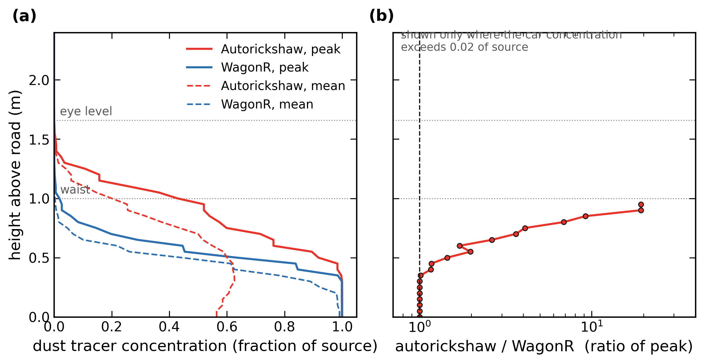

FIGURE 8: Dust tracer concentration along the pedestrian diagonal, as a fraction of source
strength. (a) Peak in solid lines and diagonal mean in dashed lines, against height, with waist and
eye level marked. (b) Ratio of peak concentrations on a logarithmic axis, plotted where the car
concentration exceeds 0.02 of source. n = 473 diagonal points for the autorickshaw and 551 for the
WagonR.

At waist height the autorickshaw delivers 23x the road air of the WagonR, 0.428 against 0.018.
Below 0.5 m the ordering reverses and the WagonR carries more, which is the signature of the
mechanism examined in Figure 10. Above about 1.3 m both values approach zero, so the quoted ratios
stop below that height.

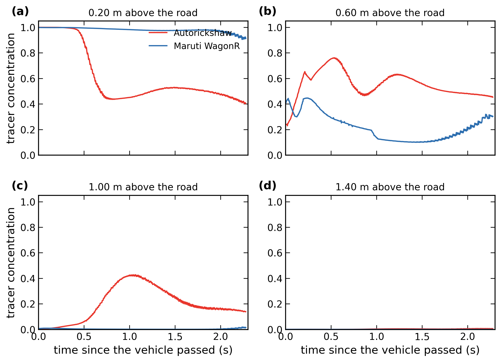

FIGURE 9: Dust arrival at the pedestrian against time since the vehicle passed, at four heights.
Each panel is one height along the same diagonal. Panel (d) at 1.40 m shows both traces close to
zero.

The two vehicles are indistinguishable at ankle height and separate progressively with height.

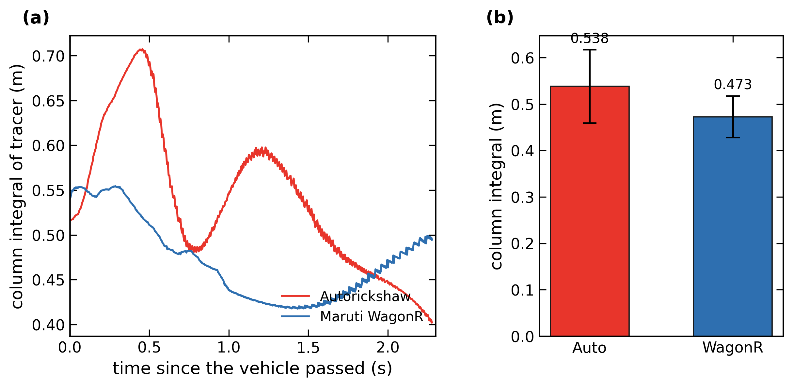

FIGURE 10: Column integral of the tracer over 0 to 2.5 m, which distinguishes vertical
redistribution from a numerical source. (a) The integral against time since the pass. (b) Mean over
the diagonal, with error bars showing one standard deviation across it. Integration uses a
51-point grid spanning 0 to 2.5 m inclusive.

The autorickshaw column holds 0.538 m against 0.473 m for the WagonR, within 14% of each other,
and the autorickshaw standard deviation is 1.8x larger. A comparable quantity of tracer occupies
the column in both cases, distributed higher and more variably behind the autorickshaw. This is
consistent with vertical redistribution as the mechanism. A spurious source in the autorickshaw
case would add tracer to its column, and the two integrals agree to within 14%, so the measurement
favours redistribution. Ruling one out would need a mass budget on the scalar, which remains
to be run. Section 7 of the report quotes 0.472 m and 0.431 m for this comparison, computed on a
coarser height grid, and both versions support the same conclusion.

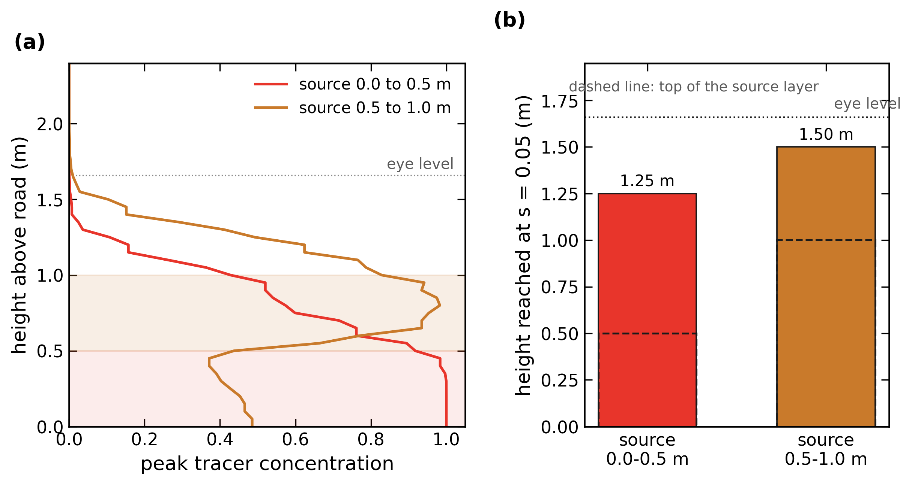

FIGURE 11: The source-height experiment. (a) Peak concentration against height for a source layer
at 0.0 to 0.5 m and the same layer lifted to 0.5 to 1.0 m, with the source bands shaded. (b) The
height at which peak concentration falls to 0.05 of source, with the top of each source layer as a
dashed line.

Lifting the source by 0.50 m raises that ceiling by 0.25 m, so transport above the source is
sub-linear. Both ceilings sit below a 1.66 m eye level. The raised source is higher than physical
wheel resuspension, so this run tests a favourable case, and the eye-level answer holds. The
ceiling value depends on the chosen threshold, and the sub-linear behaviour holds across the range
tested.

A reproducibility control repeated the autorickshaw transient case on a cell-matched mesh with
initial turbulent kinetic energy raised 1%. Energies reproduce to 0.0 to 0.3% at every height
band. URANS is close to deterministic, so this establishes reproducibility of the pipeline and
functions as a control. An uncertainty band on the physics would need a separate study.

### Animations

The transient cases are genuinely time-resolved, so every frame of the animation comes from a
solved timestep.

- [`docs/media/cfd_f4_gustview_wide.mp4`](docs/media/cfd_f4_gustview_wide.mp4) shows the full pass
  at the pedestrian plane for three vehicles, coloured by total disturbance.
- [`docs/media/cfd_f8_dust_wide.mp4`](docs/media/cfd_f8_dust_wide.mp4) shows dust transport behind
  the autorickshaw against the eye line.
- [`docs/media/cfd_f10_dustcmp_wide.mp4`](docs/media/cfd_f10_dustcmp_wide.mp4) places the
  autorickshaw and the WagonR on one shared colour scale.

Two of these are also embedded in this README as looping GIFs, at
[`docs/media/dust_comparison.gif`](docs/media/dust_comparison.gif) and
[`docs/media/gust_pass.gif`](docs/media/gust_pass.gif).

The steady cases are time-averaged solutions, so they are shown as still figures only.
`docs/figures/fields/` holds the field visualisations these animations are drawn from. Those use a
dark presentation palette and are separate from the twelve numbered figures above.

## 7. Geometry

All bodies are voxel-wrapped as signed-distance isosurfaces, manifold by construction, which makes
an arbitrary downloaded mesh watertight enough for snappyHexMesh.

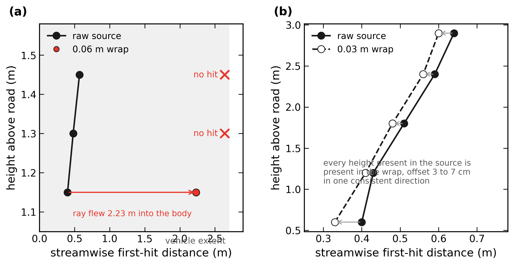

FIGURE 12: The geometry acceptance test. (a) Streamwise first-hit distance into the autorickshaw at
three heights, comparing the raw source in black with a 0.06 m wrap in red. (b) The same test on
the bus at a 0.03 m wrap.

The autorickshaw windscreen and canopy roof are single-sheet planes of zero thickness, and the
0.06 m wrap erased them. At 1.15 m a ray travelled 2.23 m into a 2.70 m vehicle, and at 1.30 m and
1.45 m it passed through entirely. The hole let flow ram into the cabin, which produced the
superseded Cd of 0.608 in Figure 4. The bus census shows every height present in the source also
present in the wrap, offset 3 to 7 cm in one consistent direction, which is the signature of a
correct isosurface.

The checks in place at the time fired lateral rays and confirmed that the open flanks survived.
That is a true result about the flanks, and the front face needed a test of its own. The
streamwise census exposed the defect in one pass. The acceptance test now requires both censuses,
agreement at every height where the source has a face, boundary edges 0, non-manifold 0, islands
1, and a bounding box checked against real-world dimensions.

## 8. Method

| | |
|---|---|
| solver | OpenFOAM v2512, `simpleFoam` steady RANS and `pimpleFoam` transient URANS |
| turbulence | k-omega SST |
| freestream | 16.67 m/s (60 km/h) |
| domain | 42 x 20 x 10 m for cars and autorickshaw, 100 x 32 x 14 m for the bus |
| blockage | 1.2% cars and autorickshaw, 1.75% bus |
| base cell | 0.5 m, identical in every case |
| surface refinement | level 4 to 5, 3 prism layers |
| decomposition | 6 MPI ranks, one per physical core |
| sampling | vertical plane at y = 1.2 m, the pedestrian standoff |

Blockage ratio is matched between differently sized bodies, which is why the bus domain is larger
at the same 0.5 m base cell. snappyHexMesh refinement levels are relative to the base cell, so
holding it fixed keeps the effective surface resolution comparable across cases.

Limitations that apply to every case: wheels are static geometry, the voxel wrap smooths the
underbody into a shell, and the autorickshaw is simulated empty, which is its most aerodynamically
favourable configuration. The bus mesh is coarser relative to its size at 2.48M cells over an 11 m
body, so its Cd carries more uncertainty and serves to bracket the range.

## 9. Repository layout

```
docs/REPORT.md      full study, including every correction and superseded result
docs/figures/       figures 1 to 12, generated by analysis/fig_*.py
docs/figures/fields/  field visualisations, dark presentation palette
docs/media/         animations of the transient cases, built by analysis/dust*.py
analysis/           figure generation, style module, committed data
cases/              OpenFOAM dictionaries for every case
scripts/            case builders and run scripts
```

## 10. Reproducing

Case construction and solve, from the validated motorBike baseline:

```bash
./scripts/mkcase.sh  AUTOW 2.162 2.765
./scripts/runcase.sh AUTOW
./scripts/report.sh  AUTOW 2.162      # mean over the final 200 iterations
```

Figures regenerate from committed data alone:

```bash
cd analysis
python fig_method.py      # figures 1, 2, 12
python fig_drag.py        # figures 3, 4, 5
python fig_exposure.py    # figures 6 to 11
```

`analysis/extract_diagonal.py` rebuilds `data/diagonal_profiles.npz` from the raw sampled planes.
It and the two animation scripts are the only code that touches the full field data.

The sampled surfaces run to tens of gigabytes and stay outside the repository. Every script that
reads them resolves its location through `analysis/paths.py`, which takes three environment
variables and records the local default for each:

```bash
python analysis/paths.py          # prints what resolves where, and what is present
export VEHICLE_AERO_FIELDS=/path/to/cfd      # parent of the case directories
export VEHICLE_AERO_OUT=/path/to/output      # where animations are written
export VEHICLE_AERO_GEOMETRY=/path/to/stl    # comparator surfaces, see geometry/README.md
```

A missing input names the path it wanted and the variable that changes it. The animations take an
optional third argument that caps the snapshot count, which runs the whole pipeline in seconds and
writes beside the finished file:

```bash
python analysis/dustvid.py wide 30 8      # smoke test, 8 frames
python analysis/dustcmp.py wide 30        # full side-by-side comparison
```

Values annotated on a capped run come from the subsample and differ from the published numbers.

## 11. Data and code availability

Every plotted value comes from `analysis/data/`. The force-coefficient histories are the solver
output. The diagonal profiles are derived once by `extract_diagonal.py` and committed.
`tables.py` records the section of `docs/REPORT.md` that each quoted value is taken from.

Colour carries meaning and holds across every figure: red autorickshaw, blue WagonR, grey Dzire,
black city bus, purple controls, orange the raised-source experiment. The shared visual grammar
lives in `analysis/thesis_style.py`, and every colour and size in the generator scripts resolves
through it.

Geometry provenance. Every surface is a voxel-wrapped derivative of a Sketchfab model, made for
this study. Licences were read from the Sketchfab API on 2026-09-05:

| surface | source model | author | licence | how it appears here |
|---|---|---|---|---|
| autorickshaw | Low Poly Autorickshaw aka TukTuk | Nirmal.Justin | CC Attribution | surface included |
| WagonR | 2013 Suzuki WagonR | BHP3D | CC Attribution | surface included |
| Dzire | 2022 Maruti Suzuki Swift Dzire | BHP3D | CC Attribution | surface included |
| city bus | Japanese bus "Nagoya City Bus" (Aichi) | VRC-IW | CC Attribution-NonCommercial | measured results |

`geometry/README.md` carries the model links and the reference quantities. The three included
surfaces are byte-identical to the ones the reported runs used, checked by MD5 against each solved
case. The bus surface stays out, because CC BY 4.0 covers the rest of this material and a
NonCommercial derivative needs terms of its own. The bus contributes measured numbers to the
figures, and those numbers are free to publish, so every figure here builds from the three
included surfaces. The wrapping procedure and the acceptance test are documented in section 7, so the
pipeline reproduces on any source mesh.

Code and analysis are released under MIT. Figures, report text and animations are released under
CC BY 4.0. The vehicle surfaces in `geometry/` remain under CC Attribution and carry credit to
their original authors.
